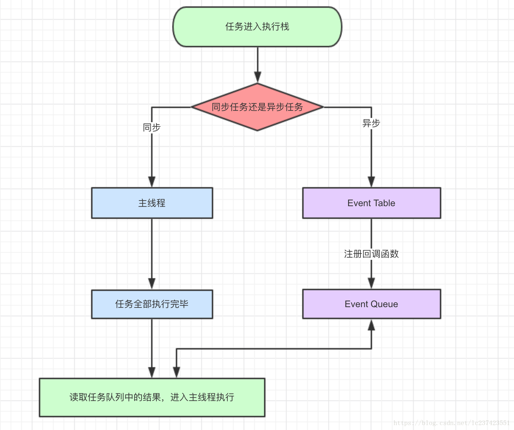
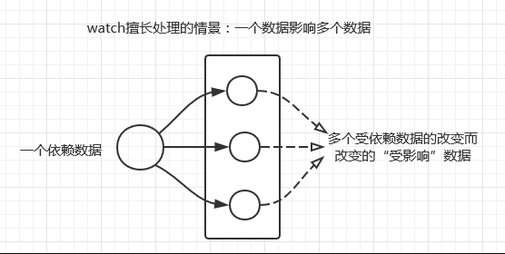

# JavaScript部分

## 原生JS

## ES6

1. promise与async/await的区别

   1. promise 采用了回调函数延迟绑定技术，执行resolve函数时，回调函数还没有绑定，推迟回调函数执行。promise管理异步编程的，本身不是异步的。

      [你真的懂promise吗？](https://segmentfault.com/a/1190000022427416)

      promise很好的解决了回调地狱问题，但是语义化不明显，代码不能很好的表示执行流程。

   2. async/await的实现基于promise，返回promise对象，是generator的语法糖。

      ### 优点：

      1. 语法简洁，更像是同步代码，也更符合普通的阅读习惯；
      2. 改进JS中异步操作串行执行的代码组织方式，减少callback的嵌套；
      3. Promise中不能自定义使用try/catch进行错误捕获，但是在Async/await中可以像处理同步代码处理错误。

      

      

2. Generator 函数的使用

3. 宏任务、微任务

   1.  异步任务分为宏任务（macroTask）和微任务（microTask）。
   2.  当满足执行条件时，task和microtask会被放入各自的队列中等待放入执行线程执行，我们把这两个队列称为Task Queue(也叫Macrotask Queue)和Microtask Queue。
       1. task：script中代码、setTimeout、setInterval、I/O、UI render
       2. microtask: promise、Object.observe、MutationObserver。
   
   - 基于微任务的技术有 MutationObserver、Promise 以及以 Promise 为基础开发出来的很多其他的技术，本题中、await fn()都是微任务。
   
   - 不管宏任务是否到达时间，以及放置的先后顺序，每次主线程执行栈为空的时候，引擎会优先处理微任务队列，**处理完微任务队列里的所有任务**，再去处理宏任务。
   
     #### 事件循环：同步和异步任务分别进入不同的执行"场所"，同步的进入主线程，异步的进入Event Table并注册函数。当指定的事情完成时，Event Table会将这个函数移入Event Queue。主线程内的任务执行完毕为空，会去Event Queue读取对应的函数，进入主线程执行。上述过程会不断重复，也就是常说的Event Loop(事件循环)
   
     
   
     
   
     宏任务一般是：包括整体代码script，setTimeout，setInterval。
   
     微任务：Promise中then，process.nextTick
   
     [宏任务、微任务](https://juejin.im/post/6844903512845860872)
   
     **运行process.nextTick时需要注意node的版本，v11与浏览器趋于相同。**
   
     

# 框架部分

## VUE框架

1. 常用的一些指令和命令修饰符

   https://blog.csdn.net/weixin_43555789/article/details/97023643

2. v-model原理

   https://www.jianshu.com/p/0d089f770ab2

3. vue组件间通信方式（父子、兄弟、跨级）

   https://segmentfault.com/a/1190000019208626

4. vuex单一数据流的理解

   https://www.jianshu.com/p/80a82e3b6e6d

5. slot和scope slot的使用场景

   https://blog.csdn.net/fang562878311/article/details/100579007

   slot分为默认插槽、具名插槽。slot作为承载分发内容的出口。

   **scope slot**为作用域插槽，主要解决父组件不能直接访问子组件定义的data数据。

6. 生命周期钩子函数，每个周期处理的业务逻辑

   https://segmentfault.com/a/1190000008010666

   

   | 钩子          | 逻辑                                                         |
   | ------------- | :----------------------------------------------------------- |
   | beforeCreate  | 在数据观测和初始化事件还未开始,data、watcher、methods都还不存在，但是$route已存在，可以根据路由信息进行重定向等操作 |
   | created       | 在实例创建之后被调用，该阶段可以访问data，使用watcher、events、methods，也就是说 数据观测(data observer) 和event/watcher 事件配置 已完成。但是此时dom还没有被挂载。该阶段允许执行http请求操作 |
   | beforeMount   | 将HTML解析生成AST节点，再根据AST节点动态生成渲染函数。相关render函数首次被调用(**重点**) |
   | mounted       | 在挂载完成之后被调用，执行render函数生成虚拟dom，创建真实dom替换虚拟dom，并挂载到实例。可以操作dom，比如事件监听 |
   | beforeUpdate  | *vm*.data更新之后，虚拟*d**o**m*重新渲染之前被调用。在这个钩子可以修改vm.data，并不会触发附加的冲渲染过程 |
   | updated       | 虚拟dom重新渲染后调用，若再次修改$vm.data，会再次触发beforeUpdate、updated，进入死循环 |
   | beforeDestroy | 实例被销毁前调用，也就是说在这个阶段还是可以调用实例的       |
   | destroyed     | 实例被销毁后调用，所有的事件监听器已被移除，子实例被销毁     |

   异步请求在哪个阶段都可以调用，因为会先执行完生命周期的钩子函数之后，才会执行异步函数，但如果考虑用户体验方面的话，在created中调用异步请求最佳，用户就越早感知页面的已加载，毕竟越早获取数据，在mounted实例挂载的时候就越及时

7. mixin filter自定义指令。编写一个自定义指令。

   [mixin](https://www.jianshu.com/p/61317558d11d)  [filter](https://www.cnblogs.com/wujiaofen/p/11236176.html)

   **1、 当有局部和全局两个名称相同的过滤器时候，会以就近原则进行调用，即：局部过滤器优先于全局过滤器被调用！**

   **2、 一个表达式可以使用多个过滤器。过滤器之间需要用管道符“|”隔开。其执行顺序从左往右。**

   [自定义指令](https://www.jianshu.com/p/c5de3aa0c465)

8. 合理使用mixin，有哪些缺点？

   mixin封装一小段想要复用的代码是有用的，但是容易造成滥用（由于不需要传递状态的特性）。此外，**使用Vue mixins时方法和参数是不共享的**。命令冲突。隐含的依赖关系（mixin和使用它的组件之间没有层次关系。组件里的变量名称修改后，mixin里没改）。

   **缺点**：

   	1. 不传递状态的原因，容易造成mixin的滥用；
    	2. 使用mixin时方法和参数不共享，造成命名冲突；
    	3. mixin与组件间的隐式依赖，容易造成变量修改出现错误。

   由于这些缺点，所以有了[composition API](https://blog.csdn.net/duninet/article/details/105716649?utm_medium=distribute.pc_relevant.none-task-blog-BlogCommendFromBaidu-1.not_use_machine_learn_pai&depth_1-utm_source=distribute.pc_relevant.none-task-blog-BlogCommendFromBaidu-1.not_use_machine_learn_pai)（受 React Hooks 的启发）。

9. vue3新的开发模式setup。vue3中的reactive api的使用

   [官方RFC](https://composition-api.vuejs.org/zh/)

10. vue.component和vue.extend区别以及使用场景

    Vue.extend返回的是一个“扩展实例构造器”，预设了部分选项的Vue实例构造器。参数是一个包含组件选项的对象。

    使用vue.component进行实例化、或使用`new extendName().$mount($el)`方式进行实例化。

    ```javascript
    let Hello = Vue.extend({
    	template: `<div>{{name}}</div>`,
    	data () {
    		return {
    			name: 'hello world'
    		}
    	}
    })
    new Hello().$mount('#app')
    ```

    **Vue.component**  用于全局注册组件

    ```javascript
    // 注册组件，传入一个扩展过的构造器
    Vue.component('my-component', Vue.extend({ /* ... */ }))
    // 注册组件，传入一个选项对象 (自动调用 Vue.extend)
    Vue.component('my-component', { /* ... */ })
    // 获取注册的组件 (始终返回构造器)
    var MyComponent = Vue.component('my-component')
    ```

11. computed、watch和methods区别

    **computed属性**：数据依赖其他数据进行变动时，使用computed。可以监控到数组与对象的变化的。

    data中没有相应的属性，也可以自定义computed属性。

    适用场景：一个数据受多个数据影响。computed是有缓存的，如果依赖的数据没有发生变化，会直接从缓存中取值。

    适用场景：

    

    **watch**：用于观察和监听页面上的vue实例。

    数据变化的同时，进行异步操作或者比较大的开销，适合watch。watch为一个对象，键是需要观察的表达式，值是对应回调函数。值也可以是方法名，或者包含选项的对象。

    data和computed中没有相应的属性，不能使用watch。

    适用场景：

    **methods**：方法只要调用，就会执行一次，需要特定的触发条件。不会缓存。

12. el template render函数和jsx的使用

    当Vue选项对象中有render渲染函数时，Vue构造函数将直接使用渲染函数渲染DOM树;

    当选项对象中没有render渲染函数时，Vue构造函数首先通过将template模板编译生成渲染函数，然后再渲染DOM树;

    而当Vue选项对象中既没有render渲染函数，也没有template模板时，会通过el属性获取挂载元素的outerHTML来作为模板，并编译生成渲染函数。
    换言之，在进行DOM树的渲染时，**优先级：** render渲染函数 > template且需编译成渲染函数 > el属性获取挂载元素的outerHTML（el对应的元素存在，前两者均不存在时）

    __________

    jsx使用需要和render一起使用，适合控制渲染逻辑的组件使用，比如循环、判断使用jsx，使用函数式组件可以提高性能。而template更简洁直观。[使用](https://blog.csdn.net/weixin_41849462/article/details/90676168)

13. data、props区别，合理划分两者界限

    理论上，data 是私有的，仅供组件本身使用；props是由上而下传递的组件属性。

    [Vue 中的 Props 与 Data 细微差别，你知道吗](https://segmentfault.com/a/1190000021651417)

14. name属性具体应用

    1. 递归组件运用（指组件自身组件调用自身组件）
    2. keep-alive包裹动态组件时，会缓存不活动的组件实例，会出现include和exclude属性，包含或者排除指定name组件
    3. vue-tools插件调试

15. keep alive作用

    用于vue组件的缓存 [keep-alive](https://www.cnblogs.com/lxlin/p/8472395.html)

16. vue项目实现动画的几种方式

17. key属性作用

18. vue router有几种路由方式

19. 路由鉴权、路由守卫

20. vuex划分模块

21. vue.use使用

22. 如何封装Vue组件

23. vue.config.js的使用

24. axios使用和请求响应拦截器

25. 常用的vue库v-lazy、element、antdesign-vue、vant、iview

26. webpack知识，常用的loader、plugin

27. css预处理器less、scss、stylus

28. ssr服务端渲染和pwa相关知识

29. 单元测试jest mocha+chai vue-test-unit使用

30. vue源码和其他框架的对比

31. MVVM框架，Vue是吗？

32. vue组件初渲染做了哪些事情

33. 响应式的原理，vue2和vue3的原理

34. nextTick的原理

35. mergeOption函数

## React框架

1. 单项数据流

2. redux/react-redux

3. 有状态组件和无状态组件的差别

4. hooks

5. 生命周期钩子

6. react性能优化（如何避免子组件频繁渲染）

   shouldComponentUpdate的使用

7. react-router/react-router-dom

8. react虚拟dom的理解以及工作原理

9. diff算法

10. jsx语法

11. 声明式编程、命令式编程、函数式编程

12. 错误边界

13. context的理解

14. react和vue对比差异、优缺点

15. 在react和vue中如何选择使用项目开发的框架

16. 直接赋值给state和使用setState的区别

    直接修改state，并没有驱动组件进行重新渲染；而this.setState()函数首先改变this.state的值，然后驱动组件经历更新过程。

17. react中prop和state的区别

    1. prop 用于外部接口，state 用于记录内部状态；
    2. prop 的赋值在外部世界使用组件时，state的赋值在组件内部；
    3. 组件不应该改变prop的值，而state存在的目的就是让组件来改变的。

18. react组件需要构造函数(constructor)的目的

    1. 初始化state 
    2. 绑定成员函数的this环境。

19. react 组件之间通信

    [组件通信](https://www.jianshu.com/p/fb915d9c99c4)

[React面试知识点](https://segmentfault.com/a/1190000019339210)

# 构建工具

## webpack相关

1. loader 和 plugin的区别

   loader 用于对模块的源代码转换，类似于gulp中task，而插件则可以用于执行范围更广的任务。包括：打包优化，资源管理，注入环境变量。

   

2. 列举几个loader并说明其作用

3. 


2019/3-至今：软通动力信息技术股份有限公司

职位：前端开发工程师

职责：

		1. 负责系统后台的前端构建和编写，并完成核心功能模块复用
  		2. 负责项目公共方法、基础组件开发以及高效复用
  		3. 持续迭代、优化项目，负责项目依赖更新升级以及性能优化
  		4. 讨论产品的设计，配合后端联调接口和数据返回
  		5. 参与测试案例评审，配合 UAT 测试，完成项目发版上线
  		6. 编写前端开发文档，维护项目上线记录日志


一、项目名称：新绿通服务系统

​		项目描述：

​				新绿通服务系统主要是给公司的运营人员使用，项目基于vue-cli构建，配合使用ElementUI等技术，负责实现系统登录登出，条件查询，数据列表分页，待办消息提醒，多类型多文件上传、回显及下载，列表数据批量导入导出等功能。

​		项目职责：

   				1. 利用vue-cli和ElementUI构建项目，封装axios实现请求统一管理
   				2. 项目中高频使用的公共方法的封装，项目组件抽离复用，自定义指令编写
   				3. 配合产品优化交互体验，改版项目布局
   				4. 复杂功能组件的封装编写
   				5.  mock 数据和服务器代理实现接口同步联调

二、项目名称：员工体重管理平台手机端

​		项目描述：员工体重管理平台是一款针对泰康公司员工身体健康分析的应用，项目使用vue-cli、vant 框架完成，主要负责健康专区相关页面的编写和开发。

项目职责：

			1. 负责健康专区相关页面的编写，以及组件的复用
   			2. 配合后端接口联调，以及配合冒烟测试
   			3. 负责修复移动端不同机型间的兼容问题
   			4. 优化页面代码，提高页面响应速度

三、项目名称：健康体检预约小程序

项目描述：健康体检预约小程序为用户健康体检预约、取消、查看报告等系列服务。项目使用微信小程序框架开发，主要负责体检预约、体检报告的编写和开发。

项目职责：

		1. 负责小程序的构建与代码开发
  		2. 优化小程序的UI设计、迭代项目代码
  		3. 联调接口，配合测试，上线发版

四、项目名称：泰康健康官网PC端

项目描述：泰康健康官网是介绍泰康健康旗下的产品及应用的网站。项目使用jQuery和Bootstrap构建完成，主要负责页面编写和接口联调。

项目职责：

			1. 负责健康官网页面的开发和编写
   			2.  优化页面中出现的兼容问题，配合后端联调
   			3. 节日活动期间官网页面改版迭代


